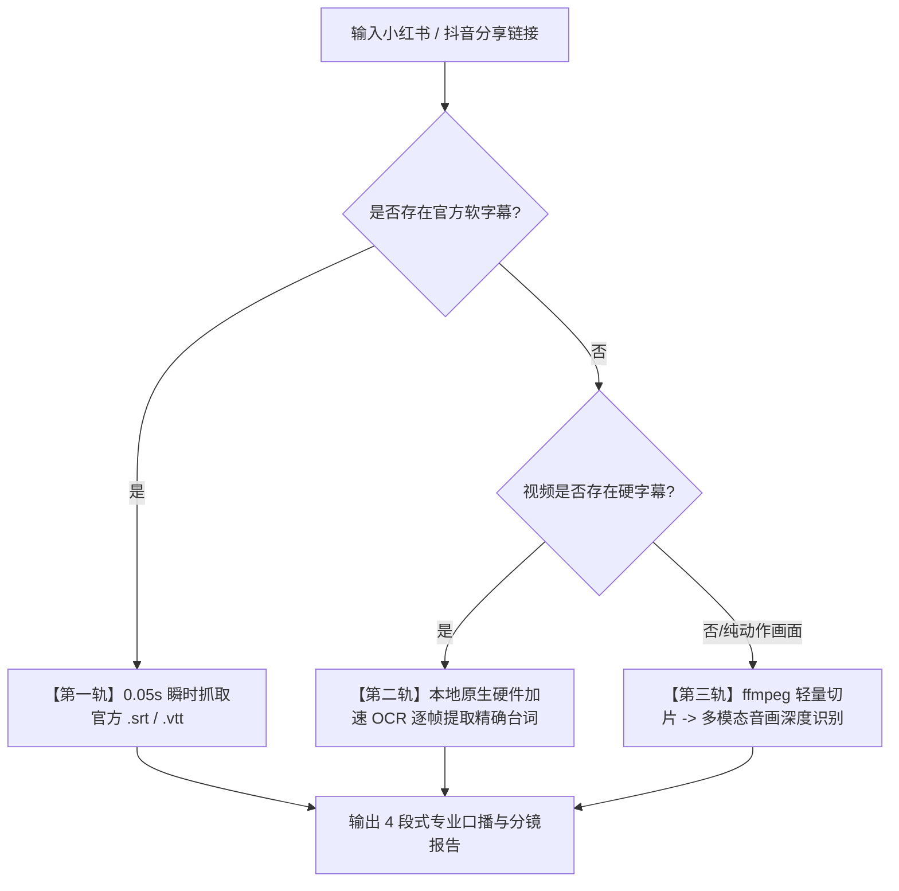

# ⚡ XHS & Douyin Transcript Extractor (小红书/抖音极速字幕与剧本提取大师)

[](https://opensource.org/licenses/MIT)
[](https://github.com/seamas0825-lab/xhs-douyin-transcript-extractor/actions)
[](https://developer.apple.com/documentation/vision)
[](https://learn.microsoft.com/en-us/uwp/api/windows.media.ocr)
[](#-为什么选择本项目)
[](#-核心原则与安全红线)

一键提取 **小红书（RED）** 与 **抖音（Douyin）** 视频的原生带时间戳字幕（SRT/WebVTT）、高清无水印直链与口播分镜剧本。

小红书直取官方 `mediaV2` 软字幕，抖音优先提取 CC 软字幕；遇到无软字幕视频时，自动调用本地原生硬件加速引擎（macOS **Apple Vision Framework** / Windows **WinRT OCR**）逐帧毫秒级提取硬字幕，彻底消除大模型盲目看视频带来的幻觉脑补与漏字风险。

---

## 🌟 核心特性 (Key Features)

- **⚡ 软字幕秒级直取（0.05s）**：通过小红书原生 SSR 水合解析与字节网关 `ttwid` 协议免登陆秒级直取官方 `.srt` 软字幕。
- **👁️ 本地硬件加速 OCR（零 Token 浪费）**：
  - **macOS**：原生 Swift + Apple Vision Framework + Apple Neural Engine (ANE) 硬件加速；
  - **Windows**：原生 WinRT `Windows.Media.Ocr` (支持 Copilot+ NPU) / RapidOCR (DirectML / ONNX Runtime)；
  - **高保真字幕去噪**：基于编辑距离（Levenshtein Ratio）与动态字幕带位置过滤，有效剔除表情贴纸与 UI 杂音。
- **🛡️ 零磁盘泄漏（Zero-Leakage Cleanup）**：所有本地临时切片与缓存数据均在提取完成后瞬间销毁，本地磁盘 0 残留。
- **🔒 严格网络安全**：默认强制启用 CA 证书链 TLS 校验，拒绝不安全连接。
- **🤖 完美适配 AI Agent / Antigravity / Claude Code / Codex**：既可作为独立命令行工具使用，也可作为标准 Agent Skill 即插即用。

---

## 🏗️ 三轨智能分流架构 (Architecture)



---

## 🚀 快速上手 (Quick Start)

### 1. 克隆仓库
```bash
git clone https://github.com/seamas0825-lab/xhs-douyin-transcript-extractor.git
cd xhs-douyin-transcript-extractor
```

### 2. 编译本地加速引擎 (macOS)
```bash
# macOS 一键编译原生 Apple Vision OCR 引擎 (仅需一次)
swiftc -O -o scripts/ocr_engine scripts/ocr_engine.swift
chmod +x scripts/ocr_engine
```

*(Windows / Linux 用户可直接运行 `pip install -r requirements.txt`)*

### 3. 一键提取视频字幕与口播
```bash
python3 scripts/extract.py "<小红书或抖音分享链接/口令>"
```

**示例输入**：
```bash
python3 scripts/extract.py "美食特种兵之长沙！不吃辣星人怎么吃！ https://v.douyin.com/q0mwVdBpp6I/"
```

**JSON 输出结构**：
```json
{
  "platform": "douyin",
  "video_id": "7645079463847284020",
  "title": "美食特种兵之长沙！不吃辣星人怎么吃！",
  "author": "神奇海挪",
  "likes": 50845,
  "collects": 5720,
  "duration_seconds": 489,
  "has_subtitles": true,
  "extraction_mode": "apple_vision_framework",
  "cues": [
    {
      "start": "00:00:00.166",
      "end": "00:00:01.566",
      "text": "美食特种兵之三天两夜"
    },
    ...
  ],
  "transcript": "美食特种兵之三天两夜 长沙人是不是喝得太好了..."
}
```

---

## 🧪 运行单元测试 (Unit Tests)

```bash
python3 -m unittest discover -s tests -p "test_*.py"
```

---

## 📄 标准 4 段式输出规范

提取完成后，可配合任意大模型生成标准化专业剧本报告：

1. **📊 1. 视频核心基础信息 (Metadata)**：标题、话题 Tags、创作者、时长、点赞/收藏与提取模式。
2. **🎙️ 2. 完整版口播文案 (Polished Transcript)**：排版通顺、标点清晰的纯文本完整段落。
3. **🎬 3. 分镜头与角色对白剧本 (Timestamped Dialogue Script)**：带时间轴、角色动线与动作细节的专业表格。
4. **💡 4. 核心亮点与配方/干货拆解 (Key Takeaways)**：提炼避坑指南、大厨配方比例、旅游路线或核心商业价值。

---

## 💻 跨平台支持矩阵 (Platform Support)

| 平台 | OCR 底层实现 | 硬件加速支持 | 外部依赖 |
| :--- | :--- | :--- | :--- |
| **macOS** | **Apple Vision Framework** (Swift) | Apple Neural Engine (ANE) + Apple GPU | **零外部依赖** (系统自带) |
| **Windows** | **WinRT `Windows.Media.Ocr`** / **RapidOCR** | Windows NPU (Copilot+) / DirectML / CUDA | `winsdk` / `rapidocr_onnxruntime` |
| **Linux** | **RapidOCR** / **Tesseract** | CPU / CUDA | `rapidocr_onnxruntime` |

---

## 📜 开源协议 (License)

本项目采用 [MIT License](LICENSE) 开源协议。
